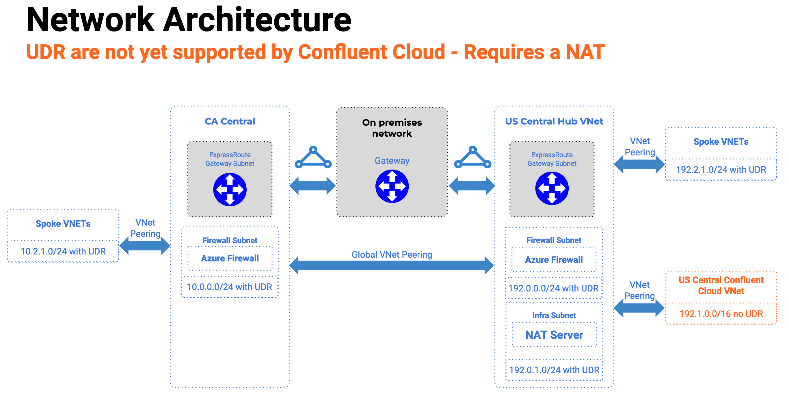

# Azure Hybrid Cloud Terraform Template

This is a demo terraform project that showcases how to setup an hybrid cloud Azure deployment accross two regions for Confluent Cloud.

Because Confluent Cloud does not support custom User Defined Route (UDR), Hub and Spoke architectures are only supported if a self managed NAT server is available within the VNET peered with Confluent Cloud.

Each individual Spoke subnet contains UDR rules to route traffic between regional hubs. The US Central Hub contains a dedicated Linux server running a MASQUERADE ip tables commands to act as a NAT server. This NAT server acts as a proxy to Confluent Cloud and handle IP Translation for spoke networks. A UDR rule on US Central Hub VNET forces traffic through the NAT server. With NAT, Kafka brokers have their response routed back to the initiating clients.



# Prerequisites

The Azure Terraform provider requires a `client_id`, `client_secret`, `tenant_id` and `subscription_id`. These can be uptained from the [Creating a Service Principal ](https://www.terraform.io/docs/providers/azurerm/guides/service_principal_client_secret.html#creating-a-service-principal) documentation section of Terraform.


# Preparing to deploy

Create an environment variable file (eg: .envrc) with the following content :

```
export ARM_CLIENT_ID="YOUR-CLIENT-ID"
export ARM_CLIENT_SECRET="YOUR-CLIENT-SECRET"
export ARM_SUBSCRIPTION_ID="YOUR-SUBSCRIPTION-ID"
export ARM_TENANT_ID="YOUR-TENANT-ID"
```

# Deploying with Terraform

```
$ source .envrc
$ terraform init
$ terraform apply
```

# Connecting to the Jumpbox (NAT server)

Look for the public ip address of the `NAT-Test-CentralUS-NAT` Virtual Machine in the `NAT-Test-CentralUS` resource group.

You can use this Virtual Machine as a jumpbox as it is the only one with a public IP. All VM have the same non secure `Password1234!` password.

```
$ ssh user@PUBLIC-IP
```

# Testing connectivity to all subnets cross region as well as the Kafka server

Once inside the NAT Server, you can use it to ssh into all the Virtual Machines spread accross the two regions. 

A test that demonstrate that the whole cross region networking works is to ssh into the `NAT-Test-CentralCA-Workload-Server-1` VM (ip : 10.2.1.4) and ping or ssh the Kafka Virtual Machine `NAT-Test-CentralUS-Cluster-1-Server-1` (ip :192.1.1.10). Any response from the server provdes that NAT server works as expected because the `192.1.1.0/24` subnet contains no routing configuration to route networking back to the cross region `10.2.1.0/24` subnet.

```
$ ssh user@192.1.1.10
```